# Contributing to Echo

This document describes the development workflow and commit conventions for the Echo project.

## Development Workflow

### Local Development

1. Clone the repository
2. Install dependencies with `npm install` or `bun install`
3. Run the development server with `npm run dev` or `bun run dev`
4. Make your changes
5. Write and run tests with `npm test` or `bun test`
6. Commit your changes following the commit conventions below

### Commit Process Diagram

```mermaid
gitGraph
    commit id: "initial commit"
    branch feat/user-auth
    checkout feat/user-auth
    commit id: "feat(auth): ✨ add user model"
    commit id: "feat(auth): ✨ add authentication service"
    checkout main
    merge feat/user-auth
    commit id: "chore: 🔖 release v1.0.0" tag: "v1.0.0"
    branch fix/login-bug
    checkout fix/login-bug
    commit id: "fix: 🐛 fix login validation"
    checkout main
    merge fix/login-bug
    branch docs/api
    checkout docs/api
    commit id: "docs: 📝 update API documentation"
    checkout main
    merge docs/api
    commit id: "chore: 🔖 release v1.1.0" tag: "v1.1.0"
    
    %% Hotfix workflow
    branch hotfix/critical-bug
    checkout hotfix/critical-bug
    commit id: "fix: 🚑️ fix critical security issue"
    checkout main
    merge hotfix/critical-bug
    commit id: "chore: 🔖 release v1.1.1" tag: "v1.1.1"
```



### Hotfix Process

For critical bugs that need immediate fixing:

1. Create a hotfix branch from the latest release tag
```bash
git checkout v1.1.0
git checkout -b hotfix/critical-bug
```

2. Fix the bug and commit with the emergency fix emoji
```bash
git commit -m "fix: 🚑️ fix critical security issue"
```

3. Submit a PR to the main branch

4. After merging, tag a new patch release
```bash
git tag v1.1.1
git push origin v1.1.1
```

### Simplified Git Workflow Steps

#### 1. Create a Feature Branch

Always create a new branch for your work, branching from `main`:

```bash
# Make sure you have the latest main
git checkout main
git pull

# Create a feature branch
git checkout -b feat/my-feature    # For new features
# OR
git checkout -b fix/issue-123      # For bug fixes
```

#### 2. Make Changes and Commit

Make your changes and commit them with conventional commit messages:

```bash
# Edit files...

# Add your changes
git add .

# Commit with conventional format
git commit -m "feat: ✨ add cool feature"
```

#### 3. Keep Your Branch Updated

If main has been updated while you work, update your branch:

```bash
# Update your local main
git checkout main
git pull

# Rebase your branch
git checkout feat/my-feature
git rebase main
```

#### 4. Push and Create Pull Request

```bash
# Push your branch
git push -u origin feat/my-feature
```

Then go to GitHub and create a Pull Request from your branch to `main`.

#### 5. Code Review and Merge

- Wait for code review
- Address feedback if requested
- Once approved, your PR will be merged into `main`
- The CI/CD pipeline will automatically build and deploy your changes

### CI/CD Pipeline

#### On Push to Main Branch

When code is pushed to the `main` branch, the following GitHub workflow is triggered:

- A Docker image is built and tagged with the short SHA of the commit
- The image is pushed to GitHub Container Registry (ghcr.io)
- The image is available as `ghcr.io/[repository]:short-sha`

#### On Release Publication

When a release is published in GitHub:

- A Docker image is built and tagged with both:
  - The release tag (e.g., `v1.0.0`)
  - The `latest` tag
- The image is pushed to GitHub Container Registry (ghcr.io)
- The image is available as `ghcr.io/[repository]:tag` and `ghcr.io/[repository]:latest`

## Commit Conventions

This project follows the [Conventional Commits](https://www.conventionalcommits.org/en/v1.0.0/) specification with [Gitmoji](https://gitmoji.dev/) for visual indication of commit types.

### Basic Format

```
<type>[optional scope]: <gitmoji> <description>

[optional body]

[optional footer(s)]
```

### Types and Corresponding Emojis

| Type | Emoji | Description |
|------|-------|-------------|
| feat | ✨ | Introduce new features |
| fix | 🐛 | Fix a bug |
| docs | 📝 | Add or update documentation |
| style | 💄 | Add or update styles and UI |
| refactor | ♻️ | Refactor code |
| perf | ⚡️ | Improve performance |
| test | ✅ | Add, update, or pass tests |
| build | 👷 | Add or update CI build system |
| ci | 💚 | Fix CI Build |
| chore | 🔧 | Add or update configuration files |
| revert | ⏪️ | Revert changes |
| hotfix | 🚑️ | Critical hotfix |

### Breaking Changes

Breaking changes should be indicated by either:
- Adding a `!` after the type/scope: `feat(api)!: remove deprecated endpoints`
- Including `BREAKING CHANGE:` in the footer

### Examples

```
feat(auth): ✨ add user authentication

Implement JWT-based authentication for users.

Closes #123
```

```
fix: 🐛 prevent race condition in request handler

Fix concurrent request handling that was causing intermittent failures.
```

```
docs: 📝 update API documentation
```

```
refactor!: ♻️ change API response format

BREAKING CHANGE: API now returns JSON objects instead of arrays
```

## Release Process

1. Create a new branch for your changes
2. Make your changes and commit them following the conventions above
3. Submit a pull request to the `main` branch
4. After approval and merge, the changes will be automatically built and deployed
5. For official releases, create and publish a GitHub release to trigger the release workflow 